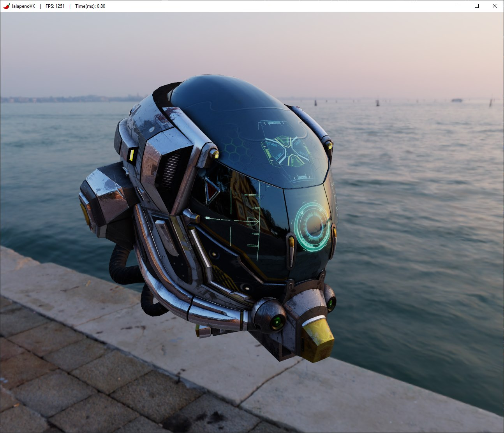
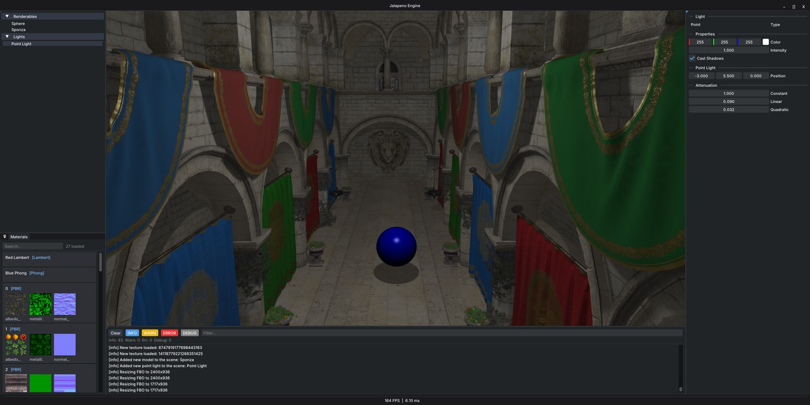

<h1 align="center">Javier Lapeña Parreño</h1>

---

<h3 align="center">Rendering Engineer &amp; Computer Graphics</h3>

  <strong>I build render engines, and I love to put them in artists' hands.</strong>

  7+ years of experience &nbsp;·&nbsp; 2 Netflix features &nbsp;·&nbsp; Film &amp; Simulation → Games

---

   
  <a href="https://github.com/jlparreno/JalapenoVK">JalapenoVK</a> — my Vulkan 1.4 engine, glTF under image-based lighting.

   
  <a href="https://github.com/jlparreno/Jalapeno">Jalapeño</a> — my OpenGL engine and its editor.

---

<h2 align="center">What Can I Do?</h2>

<table>
<tr>
<td width="33%" valign="top">

### ⚡ Real-time Rendering

*Engine cores, from the pipeline up.*

- Forward and Deferred pipelines
- **OpenGL 1.5 → 4.6** migration
- **Vulkan 1.4** engine from scratch
- Features implementation: **SSAO** and **PBR**
- Profiling: **RenderDoc**, **Nsight**

</td>
<td width="33%" valign="top">

### 🧬 Character Tech

*Where the hardest problems live.*

- **Hair and feathers** via tessellation
- **Eye refraction** via ray tracing
- **Mesh processing** and simplification
- **Real-time deformers**
- Four years in R&D at **Skydance**

</td>
<td width="33%" valign="top">

### 🛠️ Tech Art

*Rendering code artists open every day.*

- Render engine shipped **inside Maya**
- Used daily on *Swapped*, *Spellbound*
- **OpenUSD** pipeline interchange
- **Asset data** flow between teams
- Collaboration with grooming, rigging, animation, CFX

</td>
</tr>
</table>

<h2 align="center">Personal Projects</h2>

<table>
<tr>
<td width="50%" valign="top">

<h3 align="center">🌋 <a href="https://github.com/jlparreno/JalapenoVK">JalapenoVK</a></h3>

<strong>Vulkan 1.4 · C++20</strong>

Metallic-roughness PBR with image-based lighting generated on the GPU at startup, pass-based dynamic rendering, entity-component scene, Slang shaders compiled to SPIR-V.

</td>
<td width="50%" valign="top">

<h3 align="center">🌶️ <a href="https://github.com/jlparreno/Jalapeno">Jalapeño</a></h3>

<strong>OpenGL 4.6 · C++</strong>

Full **ImGui editor**: scene hierarchy, live material and transform editing, render settings, in-app console. Forward pipeline, PCF and omnidirectional shadows, HDR skybox.

</td>
</tr>
</table>

<h2 align="center">Tech Stack</h2>

  
  
  
  
  
  
  
  
  
  
  
  

<h2 align="center">Get in Touch</h2>

  
  

Madrid, Spain · Open to remote across Europe

